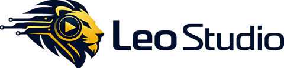
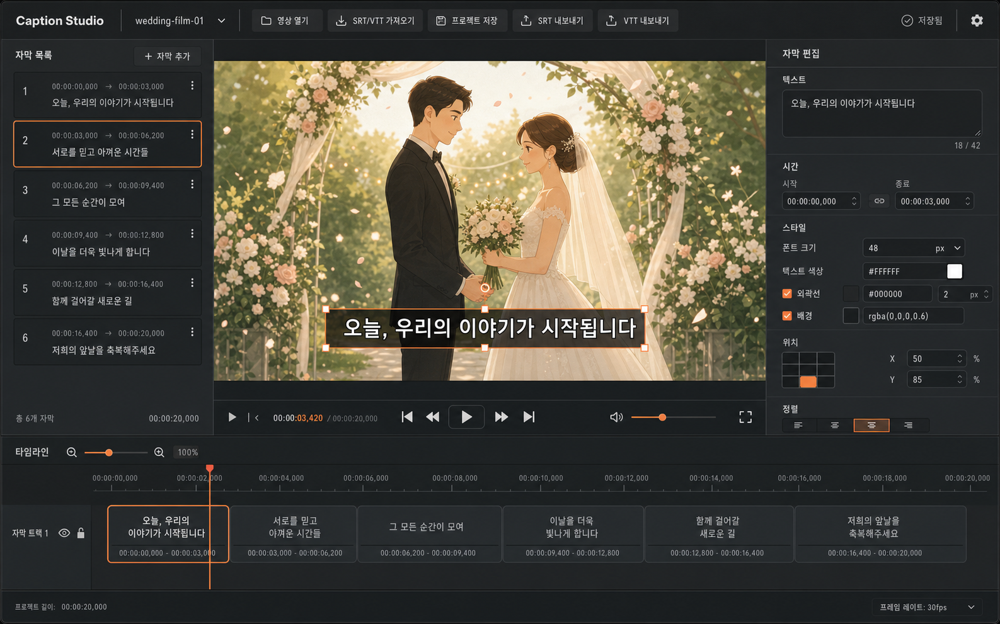

<p align="center">
  <picture>
    <source media="(prefers-color-scheme: dark)" srcset="./web/public/brand/leo-studio-dark.png">
    <source media="(prefers-color-scheme: light)" srcset="./web/public/brand/leo-studio-light.png">
    
  </picture>
</p>

<h1 align="center">Caption Studio</h1>

<p align="center">
  영상 열기부터 음성 인식, 다국어 번역, 자막 편집, 하드서브 MP4 출력까지<br>
  한 화면에서 끝내는 로컬 우선 자막 제작 스튜디오
</p>

<p align="center">
  <a href="https://github.com/suyaleo/Caption_Studio/actions/workflows/ci.yml"></a>
  <a href="https://github.com/suyaleo/Caption_Studio/releases"></a>
  <a href="./LICENSE"></a>
  <a href="https://github.com/suyaleo/Caption_Studio/pkgs/container/caption-studio"></a>
  
  
</p>

<p align="center">
  <a href="#docker로-바로-실행">Docker 실행</a> ·
  <a href="#macos-로컬-개발">macOS 개발</a> ·
  <a href="#기능">기능</a> ·
  <a href="#실행-구조">실행 구조</a> ·
  <a href="#라이선스와-브랜드">라이선스</a>
</p>



## 기능

- 로컬 영상 열기와 프레임 단위 자막 미리보기
- SRT/VTT 가져오기·내보내기
- 문구, 타임코드, 구간 길이와 타임라인 편집
- 폰트, 크기, 색상, 외곽선, 배경, 정렬과 화면 위치 조정
- macOS Apple Silicon의 `mlx-whisper` 자동 자막
- Docker/Linux CPU의 `faster-whisper` 자동 자막
- 원본 언어 자동 감지와 OpenAI-compatible 로컬 모델 번역
- 한국어·영어·일본어·중국어·스페인어·프랑스어·독일어·러시아어
- ASS 스타일 보존과 FFmpeg 하드서브 MP4 렌더링
- 작업 진행률, 검토 필요 구간, 오류와 결과 다운로드 제공
- 브라우저 자동 저장과 프로젝트 JSON 보관

> 자동 자막은 증거 기반 초안입니다. 낮은 신뢰도 구간을 성공으로 숨기지 않고 편집 화면에 검토 대상으로 남깁니다.

## Docker로 바로 실행

### GHCR 이미지

```bash
docker run --rm \
  --name caption-studio \
  -p 8788:8788 \
  -v caption-studio-data:/data \
  --add-host host.docker.internal:host-gateway \
  ghcr.io/suyaleo/caption-studio:latest
```

브라우저에서 `http://127.0.0.1:8788`을 엽니다.

### Docker Compose

```bash
git clone https://github.com/suyaleo/Caption_Studio.git
cd Caption_Studio
docker compose up --build
```

Docker 버전은 FFmpeg, libass, Noto CJK 폰트와 `faster-whisper` CPU 런타임을 포함합니다. Whisper 모델은 처음 자동 자막을 실행할 때 `/data/models`에 내려받으며, 업로드·작업·출력 파일도 `/data` 볼륨에 보존됩니다.

번역까지 사용하려면 호스트의 OpenAI-compatible 서버를 연결합니다.

```bash
CAPTION_TRANSLATION_BASE_URL=http://host.docker.internal:8000/v1 \
docker compose up
```

## macOS 로컬 개발

Apple Silicon에서는 `mlx-whisper`를 사용하는 네이티브 개발 경로가 가장 빠릅니다.

```bash
git clone https://github.com/suyaleo/Caption_Studio.git
cd Caption_Studio
bash scripts/bootstrap_macos.sh
cd web
npm run dev
```

개발 모드는 Vite(`8788`)와 Python 작업 API(`8790`)를 함께 실행합니다. 한 포트 프로덕션 빌드는 다음과 같습니다.

```bash
cd web
npm start
```

## 실행 구조

하나의 소스 트리에서 Web과 Docker가 동일한 React 빌드와 Python 작업 엔진을 사용합니다.

```text
Browser :8788
  ├─ React/Vite editor
  └─ /api
       ├─ media upload and persistent jobs
       ├─ mlx-whisper (macOS) / faster-whisper (Docker)
       ├─ OpenAI-compatible translation (optional)
       └─ FFmpeg + libass MP4 rendering
```

| 경로 | 설명 |
|---|---|
| `GET /api/health` | FFmpeg, ASR, 번역 제공자와 저장소 준비 상태 |
| `GET /api/version` | 제품명, 버전, 저장소와 라이선스 |
| `POST /api/media` | 원본 영상 업로드 |
| `POST /api/jobs/transcribe` | 자동 자막·선택적 번역 작업 |
| `POST /api/jobs/render` | 편집 스타일을 적용한 MP4 출력 |
| `GET /api/jobs/{id}` | 진행률·오류·결과 조회 |

## 환경 설정

전체 예시는 [`.env.example`](./.env.example)에 있습니다.

| 변수 | 기본값 | 설명 |
|---|---|---|
| `CAPTION_ASR_PROVIDER` | `auto` / Docker는 `faster-whisper` | ASR 제공자 |
| `CAPTION_ASR_COMPUTE_TYPE` | `int8` | Docker CPU 추론 정밀도 |
| `CAPTION_ASR_DOWNLOAD_ROOT` | `/data/models` | 모델 캐시 |
| `CAPTION_TRANSLATION_BASE_URL` | Docker에서 `host.docker.internal:8000/v1` | 번역 서버 |
| `CAPTION_TRANSLATION_MODEL` | 비어 있음 | 생략 시 첫 로드 모델 선택 |
| `CAPTION_STUDIO_MAX_UPLOAD_BYTES` | `4294967296` | 최대 업로드 크기 |

번역 서버가 없어도 편집·자동 자막·영상 출력은 동작하며, 번역 UI만 명확히 비활성화됩니다.

## 검증

```bash
PYTHONPATH=src .venv/bin/python -m unittest discover -s tests

cd web
npm run typecheck
npm test
npm run build

cd ..
python3 scripts/validate_studio_repo.py --mode release
docker build -t caption-studio:smoke .
bash scripts/docker_smoke_test.sh caption-studio:smoke
```

Docker smoke test는 컨테이너 상태, 비루트 런타임, 영속 업로드, 재시작 후 FFmpeg 하드서브 렌더와 결과 다운로드까지 확인합니다.

## 릴리스

`studio.json`, Python, Web과 Git 태그는 같은 SemVer를 사용합니다. `v0.5.0` 형태의 검증된 태그가 푸시되면 GitHub Actions가 다음을 게시합니다.

- GitHub Release
- `ghcr.io/suyaleo/caption-studio:0.5.0`
- `ghcr.io/suyaleo/caption-studio:sha-<commit>`
- 안정 릴리스의 `latest`
- 빌드 provenance와 SBOM

현재 Docker 릴리스 대상은 CI에서 검증한 `linux/amd64`입니다.

## 라이선스와 브랜드

소스 코드는 [Apache License 2.0](./LICENSE)으로 배포됩니다. 번들 구성요소의 라이선스는 [THIRD_PARTY_NOTICES.md](./THIRD_PARTY_NOTICES.md)를 확인하세요.

Leo Studio와 Caption Studio 명칭·로고는 코드 라이선스와 별개의 브랜드 자산입니다. 파생 제품은 [TRADEMARKS.md](./TRADEMARKS.md)에 따라 자체 이름과 로고로 교체해야 합니다.

---

<p align="center"><strong>Leo Studio</strong> · Local tools, production paths, visible evidence.</p>
